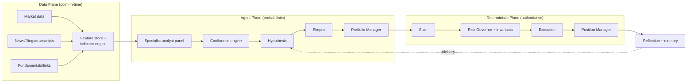
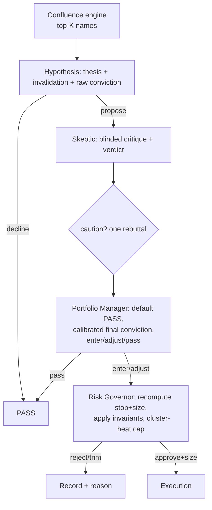
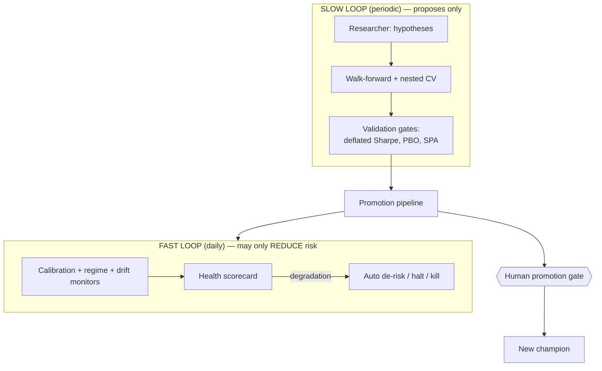

# Master Design Document
## AI-Native Multi-Agent Swing Trading System

| | |
|---|---|
| **Version** | 1.0 (consolidation; supersedes v0.1 to v0.6 and the gap analysis) |
| **Status** | Design complete for Phase 0 to 1; later phases specified at architecture level |
| **Horizon** | Swing trading, hold 2 to 20 trading days |
| **Asset class (v1)** | US equities and liquid ETFs, long-only, cash account |

> **Honest framing (read first).** This document is a complete design, not a proven strategy. No design guarantees an edge; edges are discovered empirically. The system is built to (a) discover whether documented inefficiencies still pay net of costs, (b) exploit the ones that do with discipline, and (c) detect and shut itself down if they do not. The goal is durable risk-adjusted return net of costs across regimes, not beating any fixed percentile of traders. This is not investment advice.

> **Document set.** This master is the canonical reference. Two companions remain useful: the **Validation Harness Build Spec** (the actionable first build) and `swing_bot.py` (a deterministic baseline for Phase 0). The older versioned docs (v0.1 to v0.6) are now historical; their content is consolidated here.

---

# PART I — Foundations

## 1. Purpose, scope, non-goals

**Purpose.** A system where specialist AI agents detect, synthesize, and reason about tradable instances of documented market inefficiencies, while all capital decisions pass through deterministic, auditable risk controls.

**In scope (v1):** long-only US equities/ETFs, daily decision cadence (decide post-close, execute at the next open), a full pipeline from data ingestion through deliberation, risk gating, execution, monitoring, and post-trade reflection, plus backtesting and paper-trading harnesses with strict point-in-time integrity.

**Out of scope (v1):** intraday/HFT, shorting, options/futures, leverage/margin, managing third-party money, and fully autonomous live trading without a human gate in early phases.

## 2. Guiding principles (load-bearing)

1. **Agents propose; deterministic code disposes.** No LLM ever places an order or sizes a position directly.
2. **Two-key decisions.** A trade requires both the agents to choose it *and* the deterministic Risk Governor to permit it. Either key alone cannot open a position.
3. **Asymmetric autonomy.** Automated processes may **reduce** risk on their own; they may **never add** risk, raise a limit, promote a change, or scale capital without a human.
4. **The sandbox walls are immutable to the system** (Section 3 invariants).
5. **Edges are hypotheses.** Each joins the live system only after passing validation; the AI detects and times inefficiencies, it does not invent them.
6. **Point-in-time integrity is sacred.** At decision time T, nothing timestamped after T is visible to any component.
7. **Overfitting is the assumed default.** All research and validation is guilty-until-proven-innocent.
8. **Pass is free; a bad trade is not.** The default action at every judgment point is to do nothing.

## 3. Invariants (cannot be modified by any agent or optimizer)

1. All hard risk limits (per-trade risk ceiling, name/sector/cluster caps, max positions, max heat, daily/weekly loss halts).
2. The kill switch and all kill criteria (Part VII).
3. The promotion pipeline and its gates, including the human promotion gate.
4. The holdout data vault and its access policy.
5. The asymmetric-autonomy rule.
6. The point-in-time and corporate-action data policies.

Changing an invariant is a deliberate, version-controlled human act treated as a redesign, not an adaptation.

---

# PART II — System Architecture

Three planes. Information flows left to right; capital decisions exit only through the deterministic plane.

- **Data Plane:** gathers and serves point-in-time data; computes deterministic features.
- **Agent Plane:** specialist agents score edges, a confluence engine ranks names, and the core trio deliberates.
- **Deterministic Plane:** sizes, gates against invariants, executes, and manages positions.

---

# PART III — Strategy: the Edge Portfolio & Confluence Engine

## 4. The edges (8, in 5 independent families)

| # | Edge | Family | Data | Specialist | Test cost |
|---|------|--------|------|-----------|-----------|
| 1 | Filing-text change | A: Disclosure/text | EDGAR (free) | Filings Analyst | Free |
| 2 | 8-K material event | A: Disclosure/text | EDGAR (free) | Filings Analyst | Free |
| 3 | PEAD + AI filter | B: Earnings/expectations | paid | Transcript-Tone + Catalyst | Low/paid |
| 4 | Estimate-revision momentum | B: Earnings/expectations | paid | Catalyst | Paid |
| 5 | Earnings-call tone | B: Earnings/expectations | paid | Transcript-Tone | Paid |
| 6 | Insider cluster buying | C: Informed actors | EDGAR Form 4 (free) | Insider/Ownership | Free |
| 7 | Economic-link read-through | D: Info propagation | EDGAR links + news (free-ish) | Economic-Links | Free-ish |
| 8 | Price / 52-week-high momentum | E: Price/technical | prices (free) | Market Structure | Free |

Each edge is a hypothesis with a mechanism (why the inefficiency persists), a trigger, a signal, a direction, and a pass/kill bar. Full per-edge spec cards are validated through the shared harness (Part VI). Family B's three edges are correlated and count as roughly one independent vote.

## 5. The confluence engine (deterministic)

Turns the specialist reads into the day's ranked top trades:

1. Each specialist emits `{edge_id, family, raw_score, confidence, direction, evidence_refs}`.
2. Convert `raw_score` to a cross-sectional percentile per edge (so no edge dominates by scale).
3. **Collapse within family** (take the strongest, do not sum correlated signals).
4. **Combine across families** with validated, independence-aware weights.
5. **Confluence rule:** high-confidence requires >= 2 independent families agreeing (or one exceptionally strong family).
6. Rank all high-confidence names; the **top K** (bounded by Risk Governor capacity) proceed to deliberation.

Cross-family agreement, not extra agents, is the legitimate source of higher win probability. It trades frequency for reliability.

---

# PART IV — The Agent Layer

## 6. Roster

| Agent | Domain | Type |
|-------|--------|------|
| Market Structure | Technicals, regime | Specialist |
| Catalyst / News | News, events, sentiment | Specialist |
| Filings Analyst | 10-K/10-Q/8-K diff + interpretation | Specialist |
| Economic-Links Analyst | Supplier/customer/competitor graph + read-through | Specialist |
| Insider/Ownership Analyst | Form 4 clusters, ownership | Specialist |
| Transcript-Tone Analyst | Earnings-call language/tone | Specialist |
| Hypothesis | Thesis synthesis | Core |
| Skeptic / Red-Team | Adversarial critique | Core |
| Portfolio Manager | Arbitration | Core |
| Researcher | Proposes new edges (slow loop) | Meta |
| Guardian | Exit-only re-check of open positions | Meta |
| Reflection | Attribution, lessons | Meta |

Specialists are made expert by: a single responsibility, an expert persona and method in the prompt, least-context inputs, a strict JSON output contract, and built-in calibration/falsifiability. Shared config: pinned model IDs, low temperature, structured outputs, versioned prompts, prompt caching, hard token budgets. Model tiering: `claude-haiku-4-5` for high-volume framing, `claude-sonnet-4-6` for synthesis, `claude-opus-4-8` for the adversarial Skeptic and Portfolio Manager. Full verbatim prompts: Appendix A. JSON schemas: Appendix B.

## 7. Communication protocol

- A **deterministic orchestrator** (not an LLM) drives every cycle: sequencing, timeouts, retries, idempotency (a `cycle_id` from date+config hash), and the fail-safe.
- Agents exchange only **schema-validated JSON** wrapped in an envelope `{candidate_id, agent, model_id, prompt_version, timestamp, inputs_hash, payload}`, appended to a per-candidate **Deliberation Record** (the audit artifact).
- **Least-context inputs** per agent; the **Skeptic is blinded** to the proposer's conviction; specialists run **independently in parallel** so reads cannot contaminate each other.
- **Fail to PASS:** any agent timeout/error/invalid output after one retry defaults that candidate to PASS. The system never fails *into* a trade.

## 8. The decision mechanism (deliberation to execution)

The PM's `final_conviction` must be lower than the proposer's whenever serious objections survive. The Risk Governor treats the PM's entry/stop/target as *requests*, recomputes them, and may reject or trim. Conviction scales size only within hard caps, and only after calibration cold-start (Part VI).

---

# PART V — The Deterministic Layer

## 9. Data plane

- **Universe** is a point-in-time time series of constituents including delisted names (no survivorship).
- **Prices** stored raw plus an **as-of-T** corporate-action adjustment (never future-adjusted).
- **Every record** carries `event_at`, `published_at`, and **`available_at`** (source time + conservative latency buffer). PIT filter uses `available_at <= T`.
- **Exchange calendar** (holidays/half-days), UTC internally; post-close info maps to the T+1 entry window.
- **Document policy** for the Catalyst/Filings agents: time-and-symbol-scoped retrieval (`available_at` in (T−K, T]), dedupe, rank by source/materiality, cap at N docs/M tokens (leak-safe).
- **Warm-up:** >= 250 sessions of history to be eligible.

## 10. Risk Governor and sizing (authoritative)

Hard limits (defaults, tunable but invariant in structure):

| Limit | Default |
|-------|---------|
| Risk per trade | <= 1% equity |
| Max open positions | <= 8 |
| Max portfolio heat | <= 6% |
| Max single-name exposure | <= 15% |
| Max sector exposure | <= 30% |
| Max cluster-heat (rolling-correlation cluster) | hard cap, enforced in code |
| Max new entries / cycle | <= 3 |
| Daily loss halt | -3% → no new entries |
| Weekly loss halt | -7% → halt + human review |

- **Sizing:** shares = floor( equity × risk_per_trade / (entry − stop) ), stop from ATR.
- **Precedence (G13):** caps are hard ceilings; sizing proposes shares, then shares are trimmed to the most binding cap; if below minimum viable, cancel.
- **Correlation (G14/G26):** sector taxonomy for categorical caps plus a 60-day rolling-correlation cluster (pairwise > 0.6) for cluster-heat, enforced in code, not left to PM judgment.

## 11. Two-stage entry, execution, position management

- **Stage 1 (post-close):** conditional decision keyed to an **entry band** and the resulting reward/risk, never a stale close.
- **Stage 2 (pre-open T+1):** deterministic **Entry Validator** checks the actual open; if inside the band, sizes against the **actual fill** and a stop recomputed from it; otherwise cancels. Orders are **marketable limit** at the band ceiling; unfilled in a short window → cancel.
- **Protective stop rests at the broker** immediately after fill (survives an outage).
- **Gap-aware fills (G16/G17):** if a session gaps through a resting stop/target, the fill is the **open**, not the order price. The backtest mirrors this exactly.
- **Trailing (G19):** at +1R move stop to breakeven; beyond, trail by ATR.
- **Guardian (G18):** an exit-only pass each cycle re-checks open positions for thesis-breaking catalysts; it can exit early, never add.
- **Reconciliation (G23):** broker state is ground truth; reconcile at startup and each cycle; unresolved drift halts new entries.

---

# PART VI — Validation & Backtesting Methodology

## 12. Principles

- **Point-in-time everything**, enforced in CI.
- **Deterministic-first:** validate any non-LLM version of a signal first (free, no look-ahead); test LLM lift only afterward, forward or on post-training-cutoff data.
- **The agent layer's real test is forward paper trading**, because look-ahead makes historical agent backtests untrustworthy.
- **Multiple-testing discipline:** because many edges/variants are tried, use a **Deflated Sharpe Ratio** and a data-snooping test (White/Hansen) at the portfolio level; require a higher per-edge t-stat (~2.5).
- **Probability of Backtest Overfitting (PBO)** via CSCV; reject high-PBO candidates.
- **Holdout vault:** a segregated period the optimizer never sees during search; consulted at most once per candidate; access audited.
- **Walk-forward, out-of-sample**, multi-regime, parameter-stability (plateau not spike), realistic costs and gap-aware fills, leakage canary.

## 13. Shared event-study harness

Every edge validates through one harness: PIT data, entry at t+1 open with gap-aware fills, forward windows [t+1,t+5/10/20], benchmark/sector-adjusted abnormal returns, overlapping-return correction, last-3-years OOS requirement. Each edge supplies only its trigger, signal, direction, and pass/kill bar. (Implemented per the Validation Harness Build Spec.)

## 14. Calibration cold-start

Until >= 50 closed trades, sizing is **flat (1x, no conviction scaling)**. Conviction-to-size mapping is enabled later only if measured calibration (reliability curve / Brier score) supports it.

---

# PART VII — Adaptation & Governance of Change

## 15. Two loops

- **Fast loop** monitors the live champion and can autonomously cut risk (flatten a setup, tighten caps, halt a strategy). It can never add risk.
- **Slow loop** does research and re-optimization and can only *propose*; proposals enter the promotion pipeline.

## 16. Promotion pipeline (champion/challenger)

Candidate → validation gates → single holdout look → shadow/paper (min 2 to 3 months) → tiny-capital challenger head-to-head → **human promotion gate** → champion. A winning challenger does not auto-promote (adding risk). A degrading champion auto-demotes (reducing risk).

- **Agents improve** via versioned prompts A/B-evaluated on held-out past deliberations, and curated, decayed, human-reviewed lessons. No agent edits its own authority.
- **Deterministic layer improves** via guarded walk-forward re-optimization with multiple-testing penalties and stability checks; invariants are excluded from optimization.
- **New edges/agents** plug in (trigger + specialist + confluence weight) and enter live only through this pipeline.

## 17. Capital scaling and kill criteria

**Scaling** (asymmetric): paper → seed (trivial) → ramp (on rolling OOS evidence) → full. Scaling up is a human decision; scaling down is automatic; a drawdown breach resets the ladder.

**Kill criteria (pre-committed):**
- *Strategy-level:* performance below floor for a window, drawdown breach, unrecoverable calibration red, persistent slippage >> model.
- *System-level:* portfolio drawdown breach, unresolved reconciliation drift, data-integrity failure.
- *Project-level:* after an honest paper-plus-seed cycle, no strategy clears the deflated, net-of-cost, OOS bar. Stopping is a first-class outcome.

## 18. Meta-evaluation

Track edge decay, calibration trend, post-promotion challenger win rate, and live-vs-backtest divergence (a false-discovery signal). Distinguishing skill from luck takes months to years at swing frequency; early results are mostly noise.

---

# PART VIII — Build Roadmap

1. **Phase 0:** data plane (PIT + corporate actions + leakage CI) and deterministic core (Risk Governor with invariants, sizing, gap-aware fills, Position Manager, PaperBroker). Prove a baseline backtests honestly. *(`swing_bot.py` is the starting baseline; the Validation Harness Build Spec is the first real build.)*
2. **Phase 1:** the shared validation harness; run the free edges (1, 2, 6, 7, 8) through it. First real evidence.
3. **Phase 2:** orchestrator + mock agents (plumbing before tokens).
4. **Phase 3:** real specialists (Filings, Economic-Links first), confluence engine, then the core deliberation trio.
5. **Phase 4:** fast-loop monitoring + health scorecard.
6. **Phase 5:** slow-loop research harness, promotion pipeline, then paper, then seed capital.

---

# PART IX — Open Decisions & User Inputs (gating, not design)

| Item | Needed for |
|------|-----------|
| Capital amount + risk tolerance | Sets Risk Governor values |
| Data budget | Determines reachable edges/phases (free edges = $0) |
| Broker paper account (Alpaca) + keys | Phase 3+ paper/forward testing |
| Regulatory sanity check (personal capital only) | Compliance |
| Go/no-go on economics at account size | Whether to build at all |
| Decision cadence confirmation (post-close locked) | Data availability logic |
| Initial hard-limit values | Risk Governor |
| News/filings vendor choices + PIT reliability | Live data phase |

---

# PART X — Consolidated Risk Register (top items)

| Risk | Sev | Mitigation |
|------|-----|-----------|
| Backtest looks great, fails live (overfit/leakage) | Critical | PIT, deflated Sharpe, PBO, holdout, post-cutoff/paper for agents |
| No real edge exists | High | Honest validation; project-level kill |
| Fill/reference mismatch | Critical | Two-stage entry, size-at-fill |
| Overnight gap risk | Critical | Gap-aware fills, broker-resting stops, event caps |
| Survivorship / corporate-action errors | Critical | PIT membership, as-of adjustment |
| Correlated pile-on | High | Deterministic cluster-heat cap |
| Agent cost overrun | Medium | Prefilter, tiering, caching, batch, hard budget |
| Self-improvement overfitting/drift | High | Asymmetric autonomy, promotion gates, invariants |
| Emotional override | Medium | Pre-committed kill criteria; kill switch is the only manual action |

---

# Closing

This design is complete, disciplined, adversarial, honest in its accounting, and built to fail safely and improve measurably. None of that guarantees profit. Its most valuable property is that it is built to give a *truthful* answer about whether an edge exists, including the answer "there is none, stop," which the kill criteria make a legitimate outcome. The next action is not more design; it is to build the validation harness and produce evidence.

---

# Appendix A — Full agent system prompts

*(Verbatim, shippable prompt bodies. Shared rules: structured JSON output only, low temperature, ignore any recalled future outcomes.)*

**Market Structure.** "You are a senior quantitative technical analyst. Describe the current technical state objectively and concisely. Do not predict price, do not recommend trades, use only the numeric features provided. Classify regime, judge trend quality and volatility, assess relative strength and tradability, identify nearest support/resistance. If structure is unclear or illiquid, set tradability poor. Return only the JSON schema."

**Catalyst / News.** "You are an event-driven equity analyst. Read only the documents provided. Use no knowledge of events after the decision date and ignore any recalled future outcome. For each material item, identify catalyst type, directional bias, materiality, timing, and fact/reported/rumor, citing record_id. Give a neutral narrative and a preliminary priced-in judgment. If data is thin or conflicting, lower confidence. Return only the JSON schema."

**Filings Analyst.** "You are a forensic filings analyst. Compare the current 10-K/10-Q/8-K against the comparable prior filing using only the provided texts. Identify material year-over-year changes in risk factors and MD&A and judge whether each is genuinely adverse or boilerplate. For 8-Ks, classify the event and its materiality and direction. Cite the document sections. Do not use knowledge of subsequent price moves. Return only the JSON schema."

**Economic-Links Analyst.** "You are an analyst of economic links. From disclosed relationships and the provided news, build the focal firm's supplier/customer/competitor map and infer the directional read-through of a focal catalyst to linked firms that have not yet moved. Distinguish strong from weak links. Use only provided data; ignore recalled outcomes. Return only the JSON schema."

**Insider/Ownership Analyst.** "You are an analyst of insider activity. From the provided Form 4 data, identify non-routine cluster buying (multiple insiders, senior roles, meaningful size) versus routine sales. Judge signal strength from cluster size, seniority, and amount. Use only provided data. Return only the JSON schema."

**Transcript-Tone Analyst.** "You are an analyst of earnings-call language. From the provided transcript only, assess management tone: confidence, uncertainty, evasiveness, and notable linguistic markers, separating tone from the reported numbers. Ignore any recalled future outcome. Return only the JSON schema."

**Hypothesis.** "You are a buy-side strategist designing swing trades held 2 to 20 days, long only. From the specialist reads, propose at most one thesis per name or decline. A valid thesis states a mechanism, ties to evidence, defines an expected hold and explicit invalidation conditions, and carries a calibrated raw_conviction (0.7 ≈ 70% chance). Prefer to decline on conflicting signals. Return only the JSON schema."

**Skeptic / Red-Team.** "You are a skeptical, short-biased portfolio manager. You are not told the proposer's conviction. Find every credible reason the trade is wrong: bear case, what is priced in, crowding, base rate, correlation to the open book provided, data quality, hidden assumptions. Rate each objection's severity. Be genuinely adversarial; if you cannot find a serious flaw, say why explicitly. Conclude with the strongest objection and a verdict (kill/caution/clean). Return only the JSON schema."

**Portfolio Manager.** "You are the final decision-maker. Weigh the thesis against the critique, giving more weight to high-severity objections, with the open book and hard constraints in view. Default to PASS. Choose ENTER only when a real edge survives the bear case; ADJUST when sound but mis-timed. Produce a calibrated final_conviction lower than the proposer's whenever serious objections stand. Propose entry/stop/target as requests only; set constraints_ack true; state the decisive factor. When uncertain, pass. Return only the JSON schema."

**Researcher.** "You propose candidate edges or parameter/prompt changes as falsifiable hypotheses with a stated mechanism and a pass/kill test. Your output carries no authority and must pass the validation funnel. Return only the JSON schema."

**Guardian.** "You re-check an open position for thesis-breaking new catalysts using only contemporaneous data. You may recommend an early EXIT only; you can never add to or open positions. Return only the JSON schema."

**Reflection.** "You review one closed trade and attribute its outcome, separating thesis-correctness from execution quality. Extract at most one durable, falsifiable lesson tied to a setup type. You do not change rules or limits; your output is advisory and human-reviewed. Return only the JSON schema."

---

# Appendix B — Core JSON schemas

`TechRead`, `CatalystRead`, `TradeHypothesis`, `Critique`, `RiskDecision`, `Lesson`, plus the specialist read envelope `{edge_id, family, raw_score, confidence, direction, evidence_refs}`. Field-level definitions as specified in the agent design and edge portfolio (carried forward unchanged). Schemas are frozen before coding the orchestrator.

---

# Appendix C — Glossary

PIT (point-in-time), ATR (Average True Range), heat (total open risk), expectancy (avg P&L/trade), R (risk unit = entry-to-stop distance), PEAD (post-earnings announcement drift), PBO (probability of backtest overfitting), SUE (standardized unexpected earnings), confluence (cross-family signal agreement).

---

# Appendix D — Document history (now consolidated here)

v0.1 system spec; agent design; e2e example & gap analysis (26 gaps); v0.2 gap resolutions & re-run; v0.3 adaptation & governance; v0.4 candidate edges; v0.5 Edge 1 validation & detection architecture; v0.6 edge portfolio & confluence. All superseded by this master.
